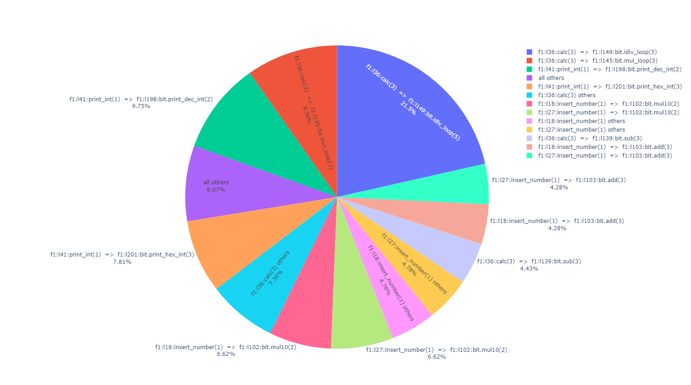

# FlipJump Source Code

In this documentation file you could find information about every python source file in the flipjump module.

## The FlipJump Macro-Assembler

The assembler has 4 steps:
- parsing the .fj text files into a dictionary of macros and their ops ([fj_parser.py](assembler/fj_parser.py)).
- resolving (unwinding) the macros (and reps) to get a straight stream of ops ([preprocessor.py](assembler/preprocessor.py)).
- resolving the label values and getting the ops binary data ([assembler.py](assembler/assembler.py)). 
- writing the binary data into the executable ([fjm_writer.py](fjm/fjm_writer.py)).

The whole process is executed within the [assemble()](assembler/assembler.py) function.

- The [ops.py](assembler/inner_classes/ops.py) file contains the classes of the different assembly ops.
- The [expr.py](assembler/inner_classes/expr.py) file contains the expression class (Expr), which is the code's representation of the assembly mathematical expressions. The expressions are based on numbers and labels.

## The FlipJump Interpreter

The Interpreter ([fjm_run.py](interpretter/fjm_run.py)) stores the entire memory in a dictionary {address: value}, and supports unaligned-word access. 

The whole interpretation is done within the [run()](interpretter/fjm_run.py) function (also uses the [fjm_reader.py](fjm/fjm_reader.py) to read the fjm file - i.e. to get the flipjump program memory from the compiled fjm file).  
More about [how to run](../README.md#how-to-run).

### The Debugger

The Interpreter has a built-in debugger, and it's activated by specifying breakpoints when called (via the [breakpoints.py](interpretter/debugging/breakpoints.py)'s `BreakpointHandler`).  
The debugger can stop on the next breakpoint, read memory, read flipjump variables, or on a fixed number of executed ops after the current breakpoint.    
In order to call the debugger with the right labels, get familiar with the [generating label names](README.md#Generated-Label-Names) (and see the debugger-image there), and use the `-d`/`-b`/`-B` cli options.  
More about [how to debug](../README.md#how-to-debug).

### Macro Usage

The [macro_usage_graph.py](interpretter/debugging/macro_usage_graph.py) file exports a feature to present the macro-usage (which are the most used macros, and what % do they take from the overall flipjump ops) in a graph.  
In order to view it, run the assembler with `--stats` (requires plotly to be installed (installed automatically with `pip install flipjump[stats]`)).  
For example:

## The Using-FlipJump Files

- The [flipjump_cli.py](flipjump_cli.py) file is the main FlipJump cli-script. run with --help to see its capabilities. The `fj` utility runs the main() of this file.
- The [flipjump_quickstart.py](flipjump_quickstart.py) file contains the fundamental assemble/run functions that are exposed to the users. They are wrappers to the inner api. These are the functions that will be exported when you `import flipjump`.

### FJM versions

The .fjm file currently has 4 versions:

- Version 0: The basic version
- Version 1: The normal version (more configurable than the basic version)
- Version 2: The relative-jumps version (good for further compression)
- Version 3: The compressed version

You can specify the version you want with the `-v VERSION` flag.  
The assembler chooses **by default** version **3** if the `--outfile` is specified, and version **1** if it isn't. 

### Generated Label Names

The generated label string is a concatenation of the macro call tree, each separated by '---', and finish with the label local-name.

Each macro call string is as follows:\
short_file_name **:** line **:** macro_called

So if a->bit.b->hex.c->my_label: (a, bit.b called from file f2 lines 3,5; hex.c from file s1, line 72), the label's name will be:\
f2:3:a---f2:5:bit.b---s1:72:hex.c---my_label

On a rep-call (on index==i), the macro call string is:\
short_file_name : line : rep{i} : macro_called\
for example: f1:32:rep6:hex.print---f2:17:print_bit---print_label

the short_file_name is (by default) s1,s2,s3,... for the standard library files (in the order of [stl/conf.json - all](stl/conf.json)),
and f1,f2,f3,... for the compiled .fj files, in the order they are mentioned to the compiler (or appear in the test-line).

You can place breakpoints to stop on specific labels using the `-d`, followed by a  `-b` and a label name (or `-B` and a part of a label name). For example:

## More Files

- The [fjm_consts.py](fjm/fjm_consts.py) contains the constants needed for interacting with the fjm format (used by the [fjm_reader.py](fjm/fjm_reader.py) + [fjm_writer.py](fjm/fjm_writer.py)).
- The [utils/](utils) folder contains common utilities used and shared by the entire project:
  - [utils/classes.py](utils/classes.py) - contains the common classes used in the entire project
  - [utils/functions.py](utils/functions.py) - contains the common utility functions used in the entire project
  - [utils/constants.py](utils/constants.py) - contains the project's constants and definitions.
  - [utils/exceptions.py](utils/exceptions.py) - contains all the project's exceptions.
- The [interpreter/io_devices/](interpretter/io_devices) folder contains modules for different Input/Output-handling classes (can be passed as a parameter to the interpreter). 
  - The standard one is [StandardIO.py](interpretter/io_devices/StandardIO.py), which takes its input from the standard input, and write its output to the standard output.
  - The tests use the [FixedIO.py](interpretter/io_devices/FixedIO.py), which takes a defined input and remembers its output.
  - If you want to assert that your program takes no input and generates no output, use the [BrokenIO.py](interpretter/io_devices/BrokenIO.py), which raises exception on every input/output.
  - Finally, the pure abstract IO handler class - [IODevice.py](interpretter/io_devices/IODevice.py).

# Read More

The FlipJump source is built in a way that allows simple addition of new features.

Every addition should be supported from the parsing level, up to the phase that is disappears (and probably is replaced with some flipjump ops). See the `assemble()` function in [assembler](assembler/assembler.py) to better understand the assembler 'pipeline'.

For example, if you want to add a new operation `a@b` that calculates _a^2+b^2_ or `a!` for _factorial(a)_, it is simple as adding a parsing rule in [fj_parser.py](assembler/fj_parser.py), and then adding the function to the op_string_to_function() in [expr.py](assembler/inner_classes/expr.py). That's it.

