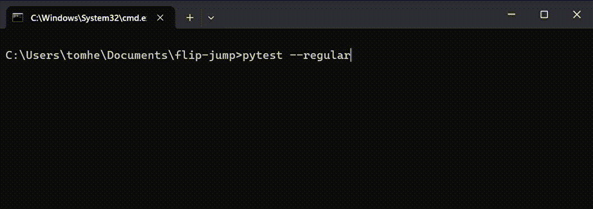
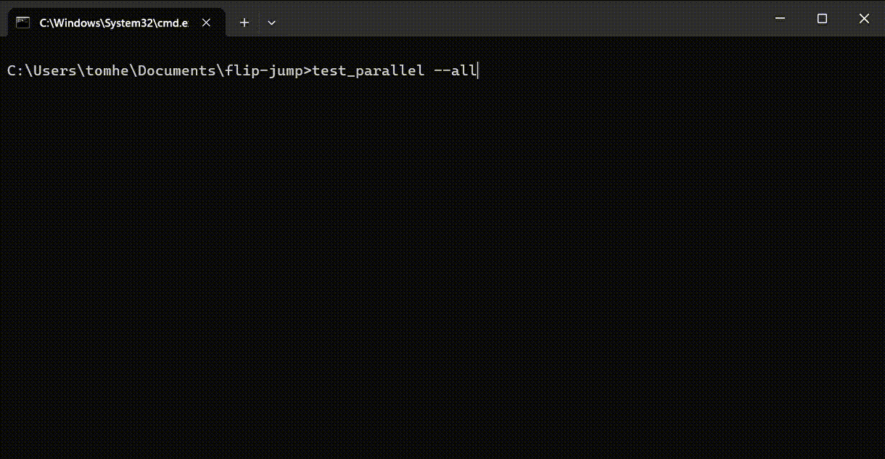

# The Testing Arena

## The CI
The project has a CI tests suit, that runs on each pull-request (using [tox](https://tox.wiki/)):
1. `--regular` tests for all supported python versions, for each os of windows, ubuntu, macos.
2. Linters: [mypy](https://mypy-lang.org/), [flake8](https://flake8.pycqa.org/en/latest/), [bandit](https://bandit.readthedocs.io/en/latest/).
   - They run for each os, with the latest supported python.
3. `pytest --all` in parallel.
   - Runs on the latest supported python, on ubuntu.
   - The results are printed as a table in the workflow summery ([for example](https://github.com/tomhea/flip-jump/actions/runs/7170673166/attempts/1#summary-19523946921)).

Any PR to the main branch must succeed in all of these tests, in order to be merged.

## Run the Linters
- `tox` - will run anything: all the linters + `pytest --regular` for all python versions + `pytest-all`.
- `mypy` - search for types related errors.
- `flake8` - search for style and syntax errors.
- `bandit --ini tox.ini` - search for common security issues.

# Run the tests:

**Run `test_parallel --all` to run all the tests, in parallel.**

Run `pytest --all` to run all the tests.  
Run `pytest` to run the fast tests.

Run with `--compile` / `--run` for testing only the compilation / the run.

Add a combination of `--fast`, `--medium`, `--slow`, `--hexlib` to run tests of different types.  
Use `--regular` to run all the fast&medium tests.  
**====> Use `--all` to run all the tests. <====**  
The default (no type flags) means `--fast`.



You can run the tests parallel with `-n auto` (using [xdist](https://github.com/pytest-dev/pytest-xdist)).  
note that this option is only allowed while using exactly one of `--compile` / `--run`.  
You can execute the `test_parallel` / `test_parallel.bat` to run parallel compile, and afterwords parallel run, with the given flags.

`test_parallel --all` example:


### Debugging info
When updating the codebase or adding new tests - Tests may fail, and it's a good thing. That way we can learn more about the code behavior. 
To get useful information out of failed tests (something like their macro-stack), you can use the `--debuginfo [LEN]` flag (Doesn't work when run in parallel).

When tests fail to complete their run (i.e. finished not by looping) the testing environment shows the last 10 executed addresses.
Using the `--debuginfo` flag adds debugging info, i.e. labels information; In that case, each of the 10 executed address will be followed by a label name like the one below.
You can also use this flag with a positive number `--debuginfo LEN` - that way the last `LEN` executed addresses will be saved (with their extensive label-names) and not just 10.

Using this flag makes the test run ~25% slower, and the compiled tests are 3-times larger (because of the debugging information). 
Yet, it's nothing compared to the debugging information you are getting: 

###### Example label name you'll get with using `--debuginfo [LEN]`:
```
  0x2c6000:
    f1:l13:hex.pop_res(1) ->
     s20:l268:hex.xor_from_ptr(2) ->
      s20:l159:hex.exact_xor_from_ptr(2) ->
       s20:l175:hex.ptr_wflip_2nd_word(2) ->
        s20:l144:hex.ptr_wflip(2) ->
         s20:l121:hex.pointers.set_flip_pointer(1) ->
          s20:l43:hex.address_and_variable_xor(4) ->
           s12:l86:rep0:hex.double_exact_xor(9) ->
            first_flip
```
That means that address 0x2c6000 is the label _first_flip_ in the _double_exact_xor_ macro (that gets 9 parameters). 
This macro got "called" from the _address_and_variable_xor_ macro (4 params) in the 86th line in the 12th stl file (in the compilation order; s stands for stl, while f stands for other files).
The current macro-expansion started in the first non-stl compiled file, in line 13, where hex.pop_res is called with 1 param.

You can get the entire "macro-stack" of the last executed addresses to get a better understanding of what happened.

More information about the labels can be found [here](../flipjump/README.md#generated-label-names).

More information about debugging with flipjump in general: [how to debug](../README.md#how-to-debug).

### Filter tests by their name 

You can filter the running tests. No filter means that all the tests in the chosen test type (--regular, --all, etc.) will run.  
Using the next filters together will take the union of the relevant tests.
 * `--name n1 n2` only run tests with these exact names.
 * `--contains n1 n2` only run tests containing one of these names.
 * `--startswith n1 n2` only run tests starting with one of these names.
 * `--endswith n1 n2` only run tests ending with one of these names.

## Add your tests:

The .csv files in this directory specify which tests to run (and what parameters to use). 

A test is a .fj program that gets compiled into a .fjm file, which gets run with a predefined input, and checks if it finished successfully with the desired output.

To support more .csv files, update [conf.json](conf.json).  
The python test itself can be found on [test_fj.py](test_fj.py) (and [conftest.py](conftest.py)).

To add a new test, create your .fj programs, and you predefined input and expected output.

Then choose the relevant csv file.  
The rule of thumb (for the sum of compile+run times, in seconds):

| fast         | medium         | slow | hexlib         |
|--------------|----------------|------|----------------|
| 0 &rarr; 0.2 | 0.2 &rarr; 0.7 | 0.7+ | tests `ns hex` |

Then add a new line to the relevant compile-csv and run-csv files, according to the next formats.

### Compile CSVs format:

(files with the next format: ```test_compile_*.csv```)

| test name    | .fj paths                                                   | out .fjm path                | memory width | version | flags | use stl | treat warnings as errors |
|--------------|-------------------------------------------------------------|------------------------------|--------------|---------|-------|---------|--------------------------|
| example_test | path/to/example_1.fj &#124; ... &#124; path/to/example_n.fj | path/to/compiled/example.fjm | 64           | 1       | 0     | True    | True                     |

Every line in this file will cause the compilation of the specified .fj files into the .fjm file, with the given compilation parameters.

Note that you can specify a single file, or a '|' separated list of files in the .fj paths cell. In case of a list, they will be compiled in the inserted order.

### Run CSVs format:

(files with the next format: ```test_run_*.csv```)

| test name    | .fjm path                    | input file path           | output file path            | is input a binary file | is output a binary file |
|--------------|------------------------------|---------------------------|-----------------------------|------------------------|-------------------------|
| example_test | path/to/compiled/example.fjm | path/to/inputs/example.in | path/to/outputs/example.out | False                  | False                   |

Every line in this file will cause the specified .fjm to run with the given input, and its output will be compared to the given expected output.

Note that you can also emit specifying a file in the input/output cell, and leave it empty. In that case an empty input/output will be used.

### Xfail Lists

If you want to add your test, but you want it to [xfail](https://docs.pytest.org/en/7.1.x/how-to/skipping.html#xfail-mark-test-functions-as-expected-to-fail), you can add your test name to:
- ```xfail_compile.csv``` - to mark its compilation as expected to fail.
- ```xfail_run.csv``` - to mark its run as expected to fail.
